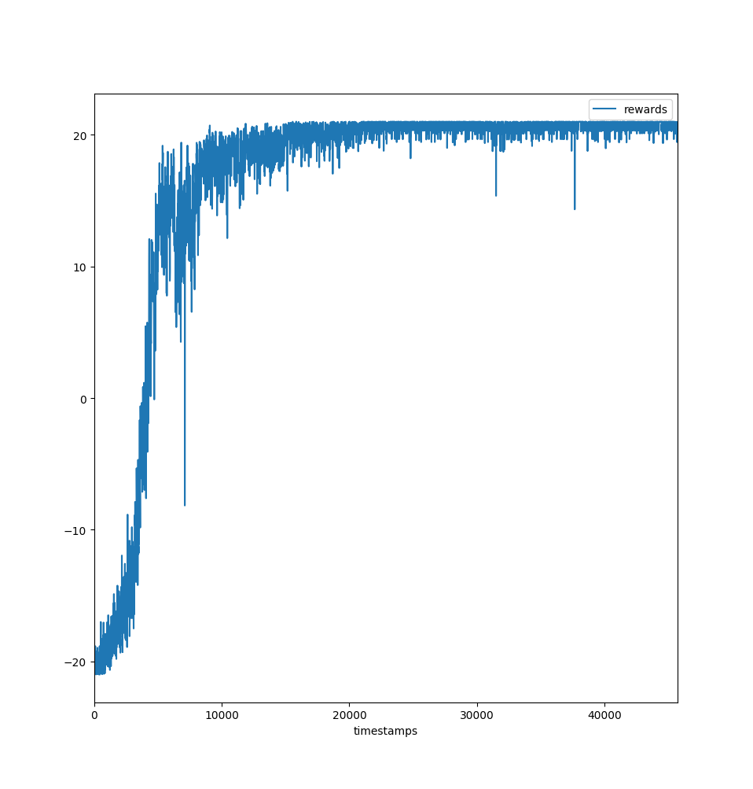

# Deep Q-Learning
Estimate the Q-values using a deep neural network and use bellman error for correcting the estimates.

## Techniques Used

 - Two neural networks - One for target which is fixed for a certain number of iteration and the other network as the current q-network of which the parameters are updated after every iteration.
 - epsilon greedy exploration - Instead of taking the action that maximises the q-value all the time we sometimes choose a random action.

## Usage
To run dqn on the game of Pong

```bash
python run_dqn_atari.py
```

## Results
<p align="center">
   
</p>



 ## Disclaimer
See http://rll.berkeley.edu/deeprlcourse/f17docs/hw3.pdf for instructions

The starter code was based on an implementation of Q-learning for Atari
generously provided by Szymon Sidor from OpenAI

