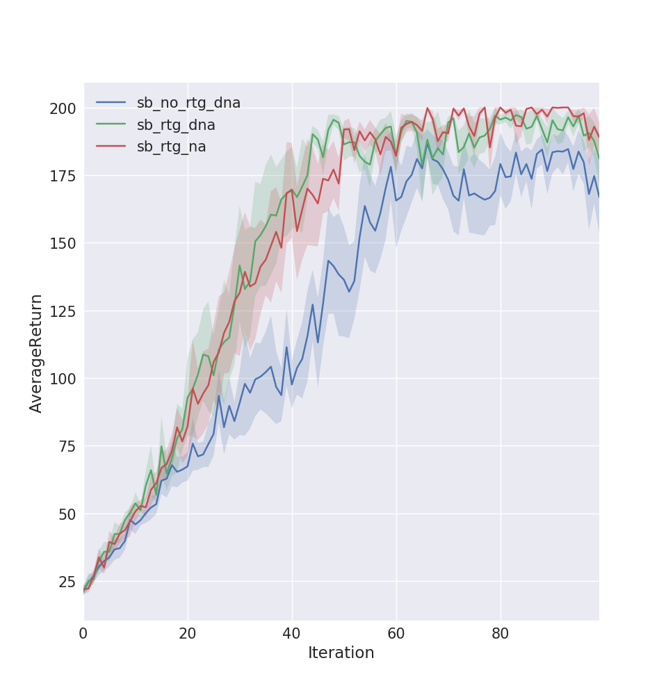
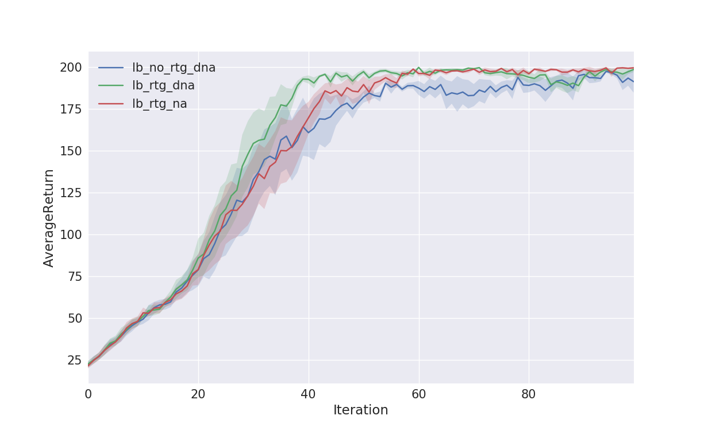
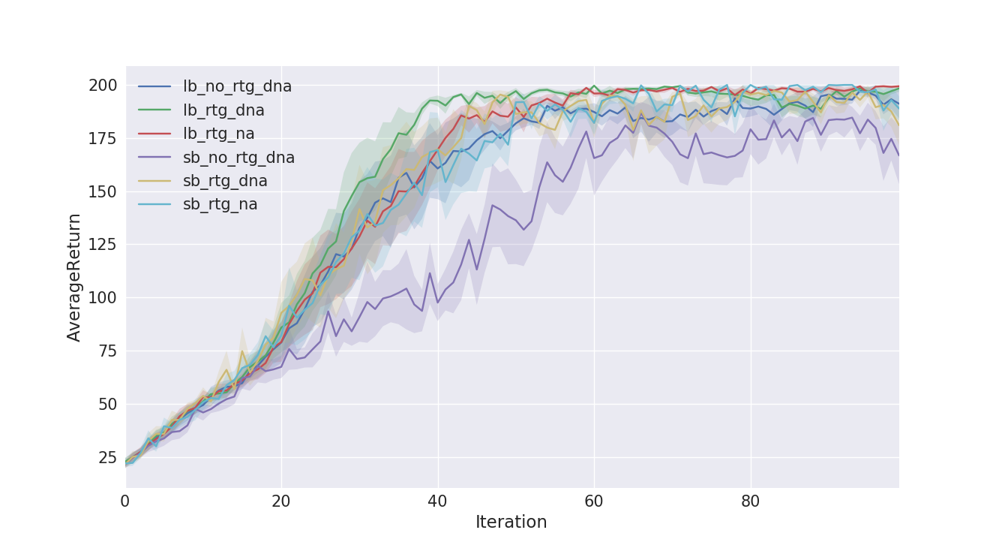

# Policy Gradients

To put simply - generate samples using the current policy, compute its gradients, weight them by the reward function
and then optimize.

## Variance reduction

The following set of methods were used to reduce the variance

 - Reward to go
 - Advantage normalization
 - Baseline estimation
 
 ## Usage
 
```bash
python train_pg.py --help
usage: train_pg.py [-h] [--exp_name EXP_NAME] [--render] [--discount DISCOUNT]
                   [--n_iter N_ITER] [--batch_size BATCH_SIZE]
                   [--ep_len EP_LEN] [--learning_rate LEARNING_RATE]
                   [--reward_to_go] [--dont_normalize_advantages]
                   [--nn_baseline] [--seed SEED]
                   [--n_experiments N_EXPERIMENTS] [--n_layers N_LAYERS]
                   [--size SIZE]
                   env_name

positional arguments:
  env_name

optional arguments:
  -h, --help            show this help message and exit
  --exp_name EXP_NAME
  --render
  --discount DISCOUNT
  --n_iter N_ITER, -n N_ITER
  --batch_size BATCH_SIZE, -b BATCH_SIZE
  --ep_len EP_LEN, -ep EP_LEN
  --learning_rate LEARNING_RATE, -lr LEARNING_RATE
  --reward_to_go, -rtg
  --dont_normalize_advantages, -dna
  --nn_baseline, -bl
  --seed SEED
  --n_experiments N_EXPERIMENTS, -e N_EXPERIMENTS
  --n_layers N_LAYERS, -l N_LAYERS
  --size SIZE, -s SIZE
  ```
  
  ## Example
  To run policy gradients on the Cartpole-v0 environment with reward to go, 100 iterations, 5 episodes and a batch size
  of 5000
  
  ```bash
  python train_pg.py CartPole-v0 -n 100 -b 5000 -e 5 -rtg --exp_name lb_rtg_na
  ```
  NOTE: The default network size is 2 hidden layers each with a hidden dimension of 64 and the number of layers can be
  changed by using -l parameter
  
  ## Results
  
  ### Small batches
  A batch size of 1000 for 100 iterations per episode and with 5 episodes was used for this experiment
  
1. sb_no_rtg_dna - Batch of 1000 with no reward to go and advantage normalization
2. sb_rtg_dna - Batch of 1000 with reward to go but no advantage normalization
3. sb_rtg_na - Batch of 1000 with reward to go and advantage normalization
    
  

 ### Large batches
  A batch size of 5000 for 100 iterations per episode and with 5 episodes was used for this experiment
  
1. lb_no_rtg_dna - Batch of 5000 with no reward to go and advantage normalization
2. lb_rtg_dna - Batch of 5000 with reward to go but no advantage normalization
3. lb_rtg_na - Batch of 5000 with reward to go and advantage normalization
    
  
  
 ### Large & Small batches
 The above two results on the same graph
 
   

  ## Disclaimer
  The code is adopted from the [DeepRL Course - CS294.](http://rll.berkeley.edu/deeprlcourse/)
